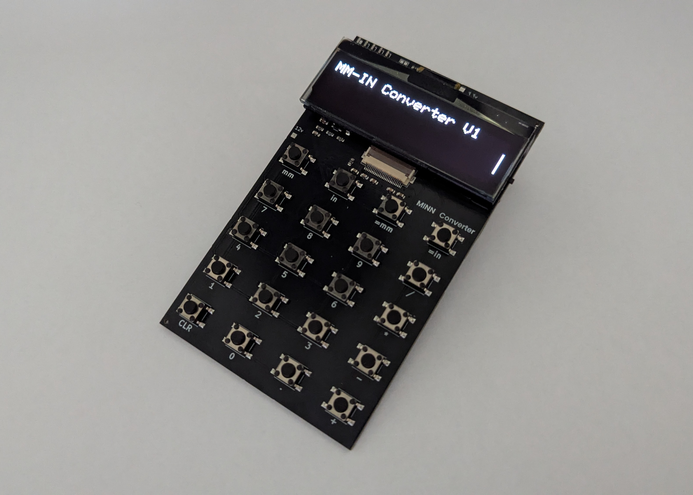
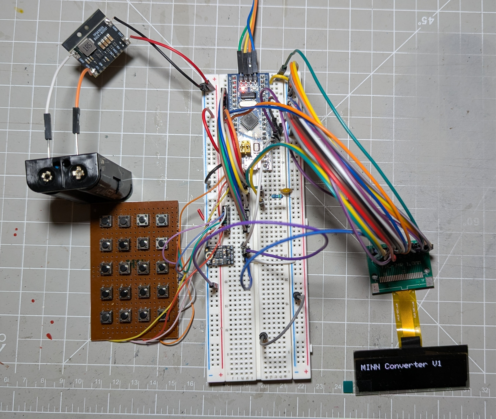

# MMIN-Converter

Simple converter for mm to inches and inches to mm. Meant as a project to advance skills in PCB design and firmware development.

## Power
2xAA batteries

## Parts
- OLED screen - 2.23 Inch OLED LCD Display Module SSD1305 Drive IC 24 Pin 12832 LCD Screen Board 128x32 SPI Interface White https://www.amazon.com/dp/B0DYXSCPYH?ref_=ppx_hzsearch_conn_dt_b_fed_asin_title_5
- Battery Holder - Philmore BH321P https://www.ebay.com/itm/175575917461

## Prototype
- Button Matrix
- 128x32 OLED
- STM32F103C8 MCU
- TPS63020 buck-boost converter (3.3v)
- TPS61040 boost converter (12v)
- 2xAA battery holder

Production took a while longer than expected, but the project is complete.

After correcting a few lines of code the converter works great.

## Construction

1. Make sure to solder the battery holder correctly.
2. Connect the OLED display to the connector before glueing any parts on.
3. I used a resin printer to make the battery shim and display holder and glued them to the board with gorilla glue.

## Changes
I made a few changes to the PCB based on what I learned from this first model.
Mainly I forgot to put the pin designations for the serial connections on the silkscreen. And having an "ON/OFF" indication would have been nice. I tried to implement that in a new version of the board, but it is still not great because screen and battery comepletely cover each side of the switch.
